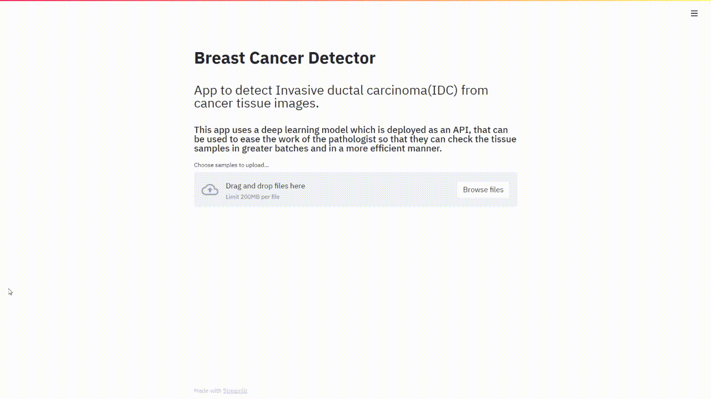

# Breast Cancer Detector(IDC) Streamlit 
A streamlit app to predict if the images of breast tissues is cancerous or not.

[Streamlit](https://streamlit.io/) is a python library that helps deploy your scripts onto the web.

## About 
This app is takes in images of breast tissue and sends it over to a CNN model trained on tissue samples using tensorflow and is deployed as and api using flask on Heroku.

The api code can be found [here](https://github.com/saaranshM/breast-cancer-detector-flask)

After uploading of images and pressing the predict button the app shows a table with the name of images and the prediction the model has produced in the prediction column.

The predictions can also be downloaded as a csv.

## Demo
Demo of the streamlit app

